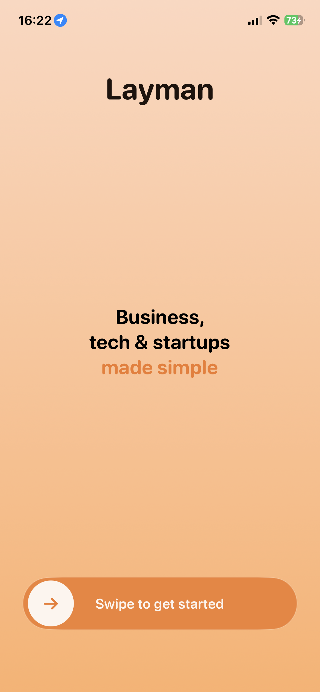
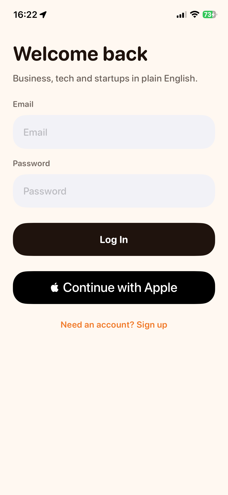
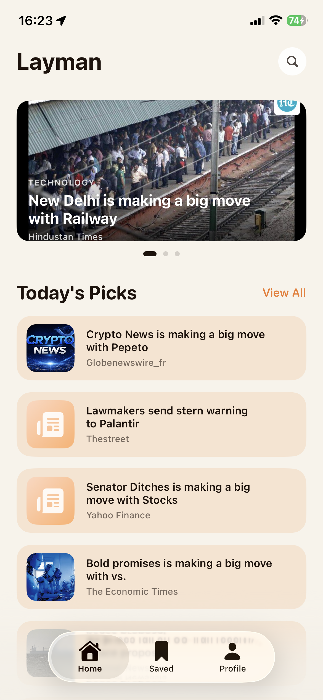
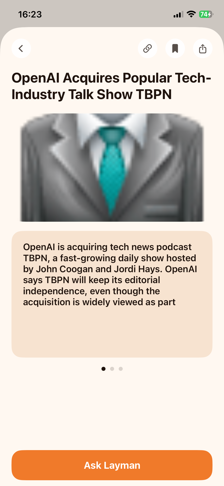
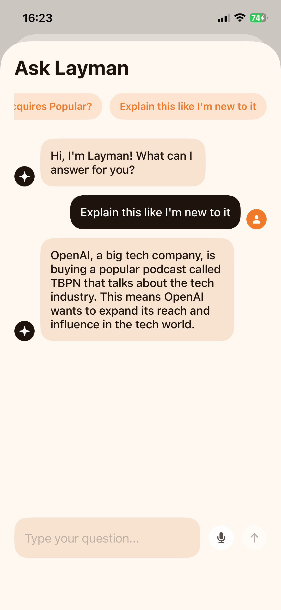
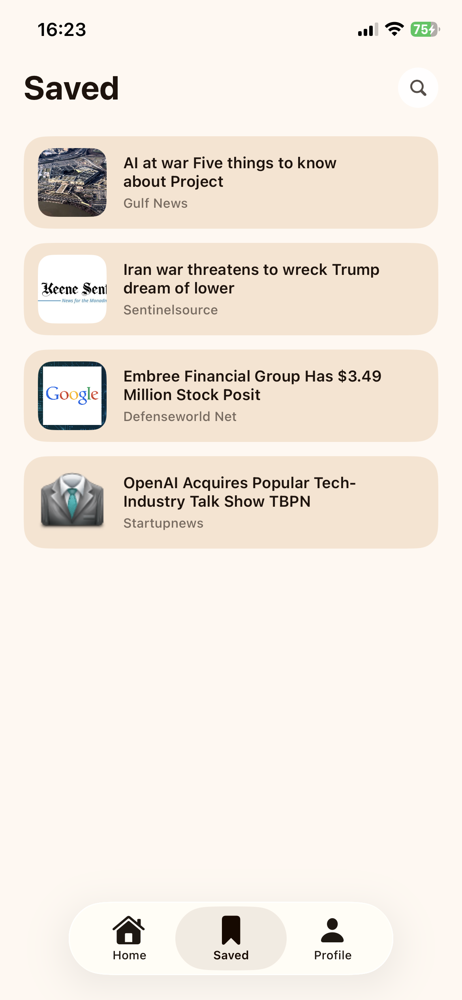
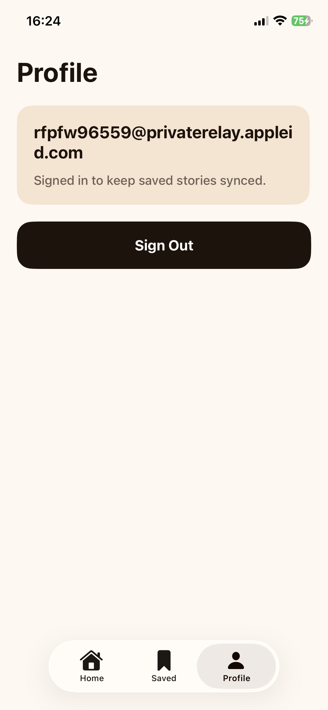

# Layman

Layman is a SwiftUI iOS news app for business, tech, and startup stories written in simple language. This repo is built for the assignment brief and uses direct REST integrations instead of third-party SDKs, so it stays self-contained.

## Stack

- SwiftUI
- Supabase Auth + PostgREST via REST
- NewsData.io for articles
- Groq or Gemini for `Ask Layman`
- MVVM-style view models

## Setup

1. Open `/Users/Furqan/Desktop/Layman/Layman.xcodeproj` in Xcode.
2. Duplicate `/Users/Furqan/Desktop/Layman/Layman/Secrets.plist.example` as `Secrets.plist`.
3. Fill these values in `Secrets.plist`:
   - `SUPABASE_URL`
   - `SUPABASE_ANON_KEY`
   - `NEWSDATA_API_KEY`
   - `AI_PROVIDER`
   - `AI_BASE_URL`
   - `AI_MODEL`
   - `AI_API_KEY`
4. Build and run the `Layman` scheme on iPhone simulator or device.

If `Secrets.plist` is missing, the app still boots with mock article data so the UI is reviewable.

## Environment Keys

`Secrets.plist` requires:

- `SUPABASE_URL`
- `SUPABASE_ANON_KEY`
- `NEWSDATA_API_KEY`
- `AI_PROVIDER`
- `AI_BASE_URL`
- `AI_MODEL`
- `AI_API_KEY`

## Supabase

Enable email/password auth and create this table:

```sql
create table if not exists public.saved_articles (
  id uuid primary key default gen_random_uuid(),
  user_id uuid not null references auth.users(id) on delete cascade,
  article_id text not null,
  headline text not null,
  source text not null,
  image_url text,
  original_url text,
  plain_summary text not null,
  raw_description text not null,
  raw_content text not null,
  category text not null,
  summary_cards text[] not null,
  created_at timestamptz not null default now(),
  unique (user_id, article_id)
);

alter table public.saved_articles enable row level security;

create policy "Users can read their own saved articles"
on public.saved_articles for select
using (auth.uid() = user_id);

create policy "Users can insert their own saved articles"
on public.saved_articles for insert
with check (auth.uid() = user_id);

create policy "Users can delete their own saved articles"
on public.saved_articles for delete
using (auth.uid() = user_id);
```

Recommended auth settings:

- Enable email/password sign-in
- Disable email confirmation for assignment/demo flow
- Enable Apple provider if you want Apple Sign In active in the running app

The SQL above is also included in:

- `/Users/Furqan/Desktop/Layman/supabase/migrations/20260402195000_saved_articles.sql`

## AI Provider Notes

- Default config is Groq using its OpenAI-compatible endpoint.
- Gemini also works by setting `AI_PROVIDER=gemini` and pointing `AI_BASE_URL` to `https://generativelanguage.googleapis.com/v1beta`.

## Assignment Notes

- Authentication persists through Keychain.
- Home includes featured carousel, search, and saved sync.
- Article detail includes 3 swipeable summary cards, in-app original article viewer, and contextual chat.
- Saved and Profile tabs are included.
- Apple Sign In is included.

## Screenshots

### Welcome



### Auth



### Home



### Article Detail



### Ask Layman



### Saved



### Profile



## AI Workflow

Primary development environment: Codex desktop / GPT-5 coding agent.

AI context file used during development: `/Users/Furqan/Desktop/Layman/CLAUDE.md`
